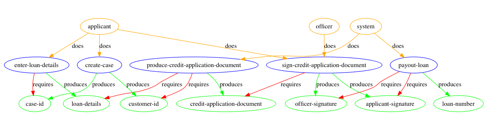

# dativity


Dativity is a stateless, data driven workflow engine library for Clojure and ClojureScript.

It is inspired by the [Artifact centric business process model.](https://en.wikipedia.org/wiki/Artifact-centric_business_process_model#cite_note-VAN2005-6)

##### Table of Contents  
[Motivation](#motivation)  
[Design](#design)  
[Features](#features)  
[Examples](#examples)  
[Dependencies](#dependencies)  
[License](#license)  

##Latest version
Version 2.0.0 comes with new features, and some smaller but nontheless breaking changes. See [Changelog](https://github.com/agentbellnorm/dativity/blob/master/CHANGELOG.md).

[](https://clojars.org/dativity)

<a name="motivation"/>

## Motivation 

Conventional process engines such as [Activiti](https://www.activiti.org/) and [Camunda](https://camunda.com/) are centered around the sequence in which activities should be performed, often modeled using BPMN.

The key idea of dativity is that the progression of data is the main driver of a workflow. It is achieved by revealing what actions _can_ be performed given how actions depend on data and what data is currently available, rather than what actions _should_ be performed.

For example, an insurance claim can not be reviewed until it has been submitted. The action of submitting produces data - the claim, and the review action depends on it. As soon as there is a claim, it's possible to perform the review action.

Many business process tools require a database to track the progress of a workflow. By adopting the Artifact centric business process model, dativity is able to provide the same core value as those other tools without requiring a dedicated database. Deciding how data is stored is up to you.

By being stateless, dativity allows you to reduce the complexity of your application.

[This blog post](https://morganbentell.wordpress.com/2019/03/18/dativity-the-stateless-process-engine/) offers a more extensive motivation.

<a name="design"/>

## Design

Dativity models a process into three different entities:
* Action
* Data
* Role

The entites relate in the following ways:
* Data (green) is _required_ by an action
* Actions (purple) _produce_ data
* Roles (yellow) _perform_ an action


_a simple credit application process_

In the above example, the action 'create case' produces the data 'case id' and 'customer-id'. When those pieces of information have been added to the case, 'enter-loan-details' can be performed because it only depends on 'case-id' to be present.

<a name="features"/>

## Features

#### Basic functionality
Given a process definition and a set of collected data, Dativity can answer questions like:
* What actions can be performed next?
* What actions can be performed next by role _r_
* What actions have been performed?
* Can action _a_ be performed?
* What data is required for action _a_?

#### Invalidating 
Sometimes a user goes back and modify data. 
Then all data that is produced 'subsequently' has to be invalidated.
Dativity has support for this type of scenario, where the case is 'rewinded' to the action that was re-done. Previously entered data is kept, but 'uncommitted', and depending actions need to be performed again.
[see example.](#invalidation)


#### Conditional requirements
It is possible to specify that a data is required by an action if and only if a given predicate is true. The condition depends on a specified data.
[see example.](#conditionally-required-data)

<a name="examples"/>

## Examples  

#### Basic functionality

The case data is just a map
```clojure
(def case {})
```

Define a case model with actions, data, roles and their relationships.
```clojure
(def case-model
  (dativity.define/create-model
    {:actions                     [:create-case
                                   :enter-loan-details
                                   :produce-credit-application-document
                                   :sign-credit-application-document
                                   :payout-loan]

     :data                        [:case-id
                                   :customer-id
                                   :loan-details
                                   :credit-application-document
                                   :applicant-signature
                                   :officer-signature
                                   :loan-number]

     :roles                       [:applicant
                                   :system
                                   :officer]

     :action-produces             [[:create-case :customer-id]
                                   [:create-case :case-id]
                                   [:enter-loan-details :loan-details]
                                   [:produce-credit-application-document :credit-application-document]
                                   [:sign-credit-application-document :applicant-signature]
                                   [:sign-credit-application-document :officer-signature]
                                   [:payout-loan :loan-number]]

     :action-requires             [[:enter-loan-details :case-id]
                                   [:produce-credit-application-document :loan-details]
                                   [:produce-credit-application-document :customer-id]
                                   [:sign-credit-application-document :credit-application-document]
                                   [:payout-loan :applicant-signature]
                                   [:payout-loan :officer-signature]]

     :role-performs               [[:applicant :create-case]
                                   [:applicant :enter-loan-details]
                                   [:applicant :sign-credit-application-document]
                                   [:officer :sign-credit-application-document]
                                   [:system :payout-loan]
                                   [:system :produce-credit-application-document]]
     :action-requires-conditional []}))

```

Generate an image of the process definition (requires graphviz, clj only).
```clojure
(dativity.visualize/generate-png case-model)
```

What actions are possible?
```clojure
(dativity.core/next-actions case-model case)
=> #{:create-case}
```

What can the roles do?
```clojure
(dativity.core/next-actions case-model case :applicant)
=> #{:create-case}
(dativity.core/next-actions case-model case :officer)
=> #{}
```

What data is produced by ':create-case'?
```clojure
(dativity.core/data-produced-by-action case-model :create-case)
=> #{:customer-id :case-id}
```

Add some data to the case to simulate a few actions
```clojure
(def case
  (-> case
    (dativity.core/add-data :case-id "542967")
    (dativity.core/add-data :customer-id "199209049345")
    (dativity.core/add-data :loan-details {:amount 100000 :purpose "home"})))
```

What actions have been completed?
```clojure
(dativity.core/actions-performed case-definition case)
=> #{:enter-loan-details :create-case}
```

Who can do what?
```clojure
(dativity.core/next-actions case-model case :applicant)
=> #{}
(dativity.core/next-actions case-model case :system)
=> #{:produce-credit-application-document}
(dativity.core/next-actions case-model case :officer)
=> #{}
```

The document is produced and it is signed by the officer
```clojure
(def case 
  (-> case
    (dativity.core/add-data :credit-application-document {:document-id "abc-123"})))
```    

Who can do what?
```clojure
(dativity.core/next-actions case-model case :applicant)
=> #{}
(dativity.core/next-actions case-model case :system)
=> #{}
(dativity.core/next-actions case-model case :officer)
=> #{:sign-credit-application-document}
```
<a name="invalidation">

#### Invalidation

A user might go back in your UI and modify data, it is then likely that 'subsequent' data is no longer valid. For example, if the loan amount is changed, the produced application document is probably not valid anymore.

Dativity supports this via the function invalidate-data. When a data is invalidated, all the data that is produced by actions that depend on the invalidated data is invalidated recursively.

When data is invalidated, it is not deleted. The data is kept, but it is 'uncommitted' which means that dativity will say that actions that depend on the uncommitted data are not allowed.

```clojure
(def case
    (dativity.core/invalidate-data case-model case :loan-details))
```

Are the loan details gone from the case?

```clojure
(:loan-details case)
=> {:amount 100000 :purpose "home"}
```

Now the only available action is to enter loan details again.
```clojure
(dativity.core/next-actions case-model case :applicant)
=> #{:enter-loan-details}
(dativity.core/next-actions case-model case :system)
=> #{}
(dativity.core/next-actions case-model case :officer)
=> #{}
```

It's not possible to sign the credit application document. 
```clojure
(dativity.core/action-allowed? case-model case :sign-credit-application-document)
=> false
```

<a name="conditionally-required-data">

#### Conditionally required data

An action-requires-data edge (red arrow in the diagram) can be conditional. The requirement is enforced if and only if a given predicate is true. The predicate is a function of a given data node.

To say that applications for loans of more than 300 000 require signatures from two officers we can write

```clojure
(def case-model 
     (dativity.define/add-relationship-to-model case-model
                                                (dativity.define/action-requires-conditional
                                                  :payout-loan
                                                  :counter-signature
                                                  (fn [loan-details]
                                                      (> (:amount loan-details) 300000))
                                                  :loan-details)))
```

<a name="dependencies"/>

## Dependencies

#### graphviz
To generate graph images you need [graphviz](https://graphviz.gitlab.io/download/).

Check if it's installed on your system (mac):
`dot -v`

If not, install it: 
`brew install graphviz`


####Ubergraph
[Ubergraph](https://github.com/Engelberg/ubergraph) is used as an adapter to graphviz for vizualisation and is not used by the main namespaces so it will not be included in a cljs build.

####Ysera
[Ysera](https://github.com/tomas81508/ysera) is a convenience library from which testing and errror macros are used.

<a name="license"/>

## License

MIT License

Copyright (c) 2019 Morgan Bentell
